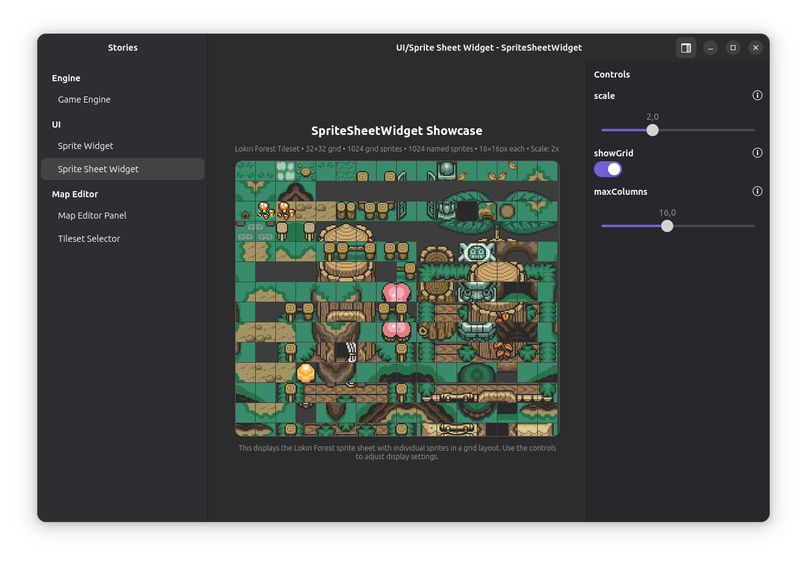

# @pixelrpg/storybook-gjs

A Storybook application for testing and showcasing GTK widgets used in the PixelRPG Map Editor project.



## Overview

This application provides an interactive environment for developing and testing GTK widgets used in the PixelRPG Map Editor. Built using the GNOME technology stack (GTK, Adwaita, GJS), it offers a familiar Storybook-like experience adapted for native GTK applications.

## Features

- **Interactive Widget Testing**: Test and preview GTK widgets in isolation
- **Real-time Property Controls**: Adjust widget properties and see changes instantly
- **Adwaita Integration**: Follows GNOME's Adwaita design guidelines
- **Development Tools**: Built-in debugging and inspection capabilities

## Getting Started

### Prerequisites

- GNOME JavaScript (GJS) runtime
- GTK 4.x and Adwaita libraries
- Node.js and Yarn
- Blueprint Compiler (for UI templates)

### Installation

```bash
# Install dependencies
yarn install
```

### Development Commands

```bash
# Build the application
yarn build

# Start the application
yarn start

# Start with GTK debugging enabled
yarn start:debug

# Type checking
yarn check
```

## Project Structure

- `src/`: Source code directory
  - `widgets/`: Story implementations for GTK widgets
  - `types/`: TypeScript type definitions
  - `application.ts`: Main application setup
  - `main.ts`: Application entry point

## Available Stories

The storybook currently includes stories for:

- **Engine Components**: Game engine related widgets
- **UI Components**: General UI widgets used in the map editor
- **Map Editor**: Specialized widgets for map editing functionality

## Development Guidelines

When adding new stories:

1. Create story files in the appropriate category directory
2. Use the `@pixelrpg/story-gjs` framework for story creation
3. Include comprehensive controls for widget properties
4. Add appropriate documentation and examples

## Debugging

For interactive debugging:

```bash
# Start with GTK debugging enabled
yarn start:debug
```

This will open the GTK Inspector alongside the application, allowing you to:
- Inspect widget hierarchy
- Monitor widget properties
- Debug layout issues
- Profile performance

## Dependencies

- **@pixelrpg/story-gjs**: Core storybook functionality
- **@pixelrpg/engine-gjs**: Game engine GTK components
- **@pixelrpg/ui-gjs**: Common UI widgets
- **@girs/***: GTK and GNOME platform bindings

## Related Documentation

- [GTK Documentation](https://docs.gtk.org/)
- [GJS Guide](https://gjs.guide/)
- [Blueprint UI Reference](https://jwestman.pages.gitlab.gnome.org/blueprint-compiler/)
