# Editor UI Screenshots

A visual reference of **every top-level view** of the PixelRPG Map Editor
(`@pixelrpg/maker-gjs`), captured at three responsive form factors. This is the
baseline snapshot for the upcoming UI redesign — one image per (view × tier),
plus a short description of what each view is *for* and what you can (or should
be able to) *do* there.

## How these were captured

- **Tooling:** the running editor was driven over its `org.pixelrpg.maker.Control`
  D-Bus interface via the `maker` MCP bridge (`gjsify debug` / `apps/mcp-bridge`).
  PNG bytes were pulled from the `Screenshot(scope)` method
  (`scope = "window"` — full app chrome + canvas; `scope = "canvas"` — the raw
  WebGL framebuffer with no chrome).
- **Sample project:** `games/oot2d-2014` ("OoT2D 2014 World") — the richest bundled
  project (19 maps, 20 tilesets), so tilesets/atlas/scene-editor appear fully
  populated. The scene-editor shots show the **Kokiri Forest** scene.
- **Tiers** (via `resize_window` presets):
  | Folder | Preset | Size (px) | Chrome behaviour |
  |---|---|---|---|
  | [`desktop/`](desktop/) | `desktop` | 1280 × 800 | both sidebars persistent |
  | [`tablet/`](tablet/) | `tablet` | 768 × 1024 | left library collapses to a drawer (atlas + scene-editor) |
  | [`phone/`](phone/) | `phone` | 400 × 880 | both sidebars collapse; chrome becomes floating OSDs |

  Breakpoint rules live in [`../concepts/responsive-chrome.md`](../concepts/responsive-chrome.md).

### Two capture artifacts to ignore in the redesign

- **"AI Assistant" presence chip** (purple avatar + pause button, bottom-left of
  the scene-editor/atlas): that is *this automation* joining the session as a
  collaborator. It only shows because the editor was driven externally — it is
  not part of the normal single-user chrome.
- **Atlas opens at 200 % zoom**, so scene cards overflow the viewport in the
  screenshot. The atlas is a pannable/zoomable canvas; the framing is not fixed.

## Three rows (2026-09-06)

The information-architecture milestone turned the six-row rail into
three — **World** (the atlas + the map editor), **Library** (Cast,
Objects and Sheets merged behind three chips: Characters · Things ·
Graphics) and **Game** (the former Data page) — and made the UI say
"map" and "World" where it said "scene" and "Atlas". The captures below
are that state at the desktop preset (1280 × 800, `games/zelda-like`
seeded with a chest, a sign and a villager so Things has three groups),
driven the same way as the baseline. The baseline sections further
down describe the six-row layout they replaced and stay as the
before-picture.

| # | Capture | What it shows |
|---|---|---|
| 01 | [`ia/01-world.png`](ia/01-world.png) | The rail's three rows with World active; the "New map" pill |
| 02 | [`ia/02-library-characters.png`](ia/02-library-characters.png) | Library › Characters: the chip group in the header, the "+" for a character, the roster + detail split |
| 03 | [`ia/03-library-things.png`](ia/03-library-things.png) | Library › Things grouped by `editorData.category`: Objects, Heroes (with the Character badge), NPCs |
| 04 | [`ia/04-library-graphics.png`](ia/04-library-graphics.png) | Library › Graphics: tilesets + appearances, the quick-view toggle at the header's end |
| 05 | [`ia/05-game.png`](ia/05-game.png) | Game: project, tile settings and the always-on game rules — the "Linked assets" group is gone |
| 06 | [`ia/06-open-recent.png`](ia/06-open-recent.png) | The primary menu's "Open Recent", which had no handler before |
| 07 | [`ia/07-deep-link-open-object.png`](ia/07-deep-link-open-object.png) | `win.open-object 'chest'` from the Game page lands on Library › Things, in the detail |
| 08 | [`ia/08-deep-link-open-character.png`](ia/08-deep-link-open-character.png) | `win.open-character 'link'` lands on Library › Characters with Link selected |
| 09 | [`ia/09-map-editor.png`](ia/09-map-editor.png) | The map editor: "‹ World" is the way back, the rail tagline says "Map editor" |

## Structure

```
docs/screenshots/
├── README.md            ← this file
├── desktop/             ← 1280×800
│   ├── 01-welcome.png
│   ├── 02-atlas.png
│   ├── 03-cast.png
│   ├── 04-objects.png
│   ├── 05-tiles.png
│   ├── 06-data.png
│   ├── 07-scene-editor.png
│   └── 07-scene-editor-canvas.png   ← pure WebGL framebuffer (no chrome)
├── tablet/              ← 768×1024   (01…07, same view order)
└── phone/               ← 400×880    (01…07, same view order)
```

File names are numbered in the order the views appear in the app's view switcher
(`welcome → atlas → cast → objects → tiles → data → scene-editor`) so the three
tier folders line up 1:1.

---

## The views

### 01 · Welcome

| Desktop | Tablet | Phone |
|---|---|---|
| [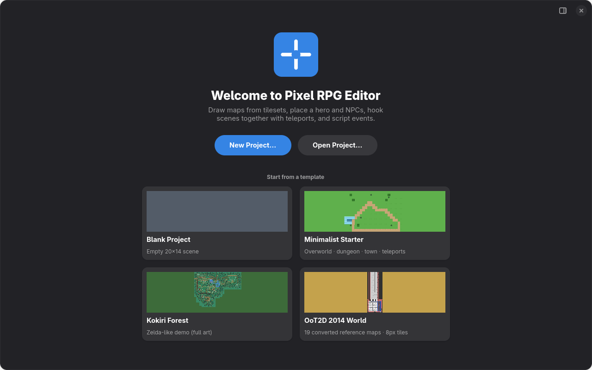](desktop/01-welcome.png) | [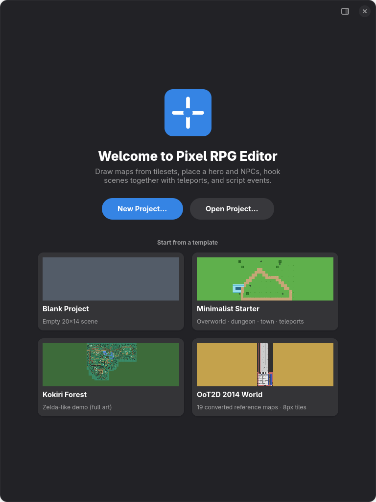](tablet/01-welcome.png) | [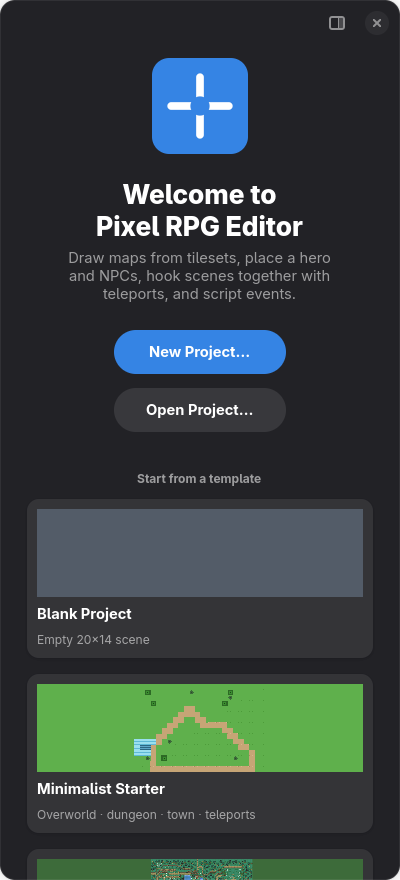](phone/01-welcome.png) |

**Purpose** — the launch screen shown when no project is open. Entry point into
the app: *"Draw maps from tilesets, place a hero and NPCs, hook scenes together
with teleports, and script events."*

**What you do here**
- **New Project…** / **Open Project…** (create a project or open an existing
  `game-project.json`).
- **Start from a template** — a gallery of starter projects (Blank Project,
  Minimalist Starter, Kokiri Forest, OoT2D 2014 World), each with a baked map
  thumbnail.

**Should be doable / redesign notes** — recent-projects list is reachable via a
header action but isn't surfaced on this screen; the template gallery is the only
content and doesn't scroll/filter yet.

### 02 · Atlas

| Desktop | Tablet | Phone |
|---|---|---|
| [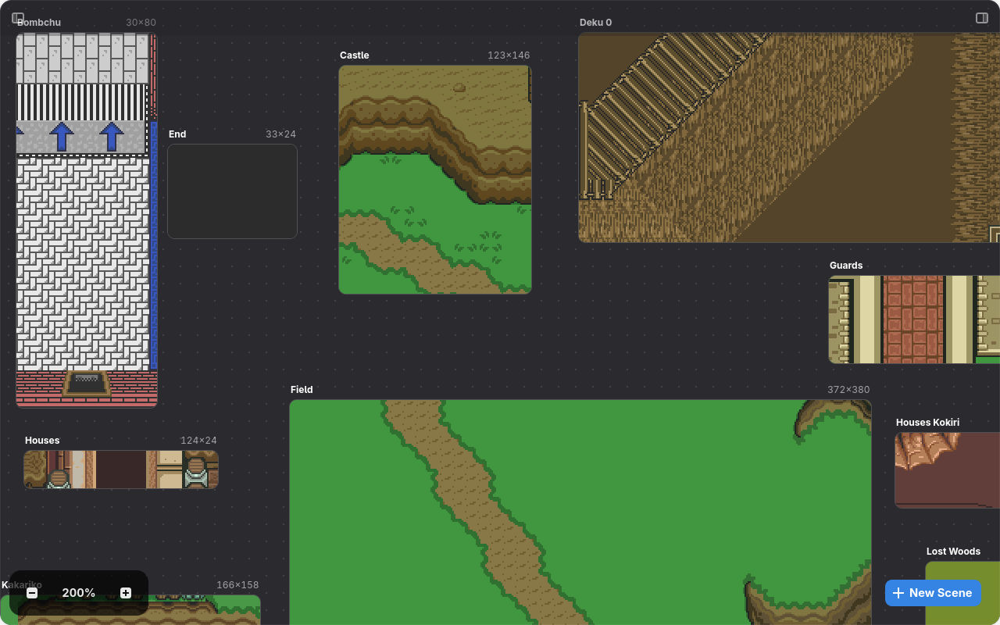](desktop/02-atlas.png) | [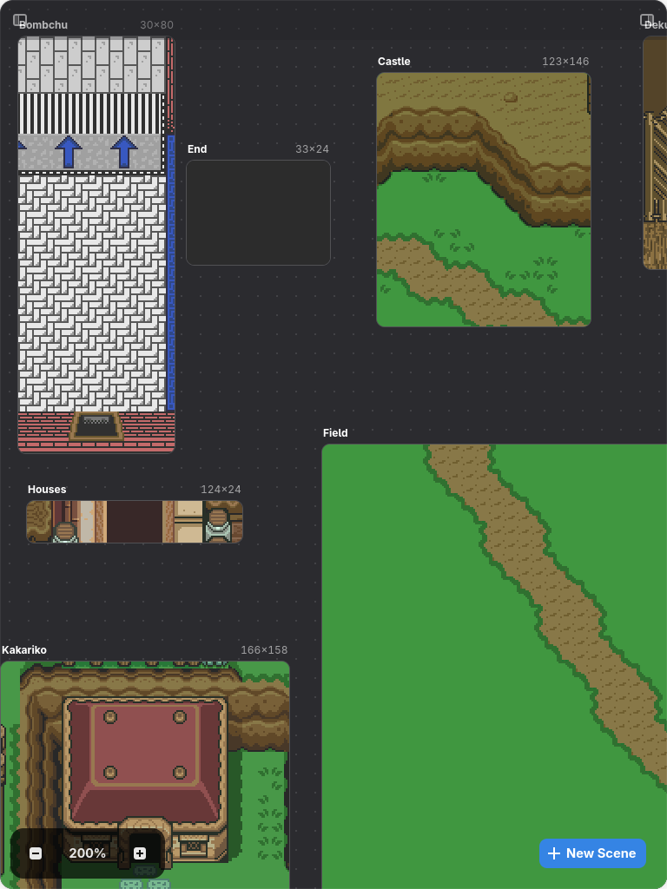](tablet/02-atlas.png) | [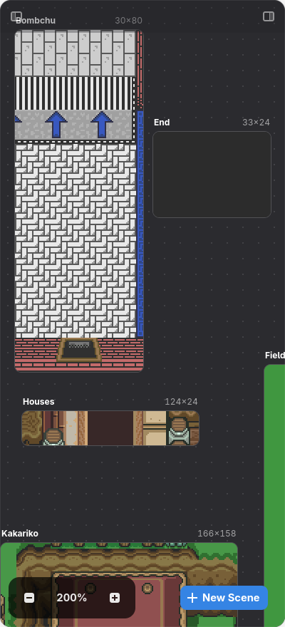](phone/02-atlas.png) |

**Purpose** — a spatial map of **all scenes in the project**, each rendered as a
card (with its pixel dimensions) on an infinite pannable/zoomable canvas. The
"home base" you return to from the scene editor (the ← Atlas button).

**What you do here**
- Get an overview of every scene and roughly how they relate spatially.
- **New Scene** (FAB, bottom-right).
- Open a scene into the editor by activating its card.
- Pan / zoom the canvas (zoom OSD, bottom-left).

**Should be doable / redesign notes** — opens zoomed in (200 %) with no
fit-to-content; there's no obvious way to re-arrange/link cards or see teleport
connections between scenes on the atlas surface.

### 03 · Cast

| Desktop | Tablet | Phone |
|---|---|---|
| [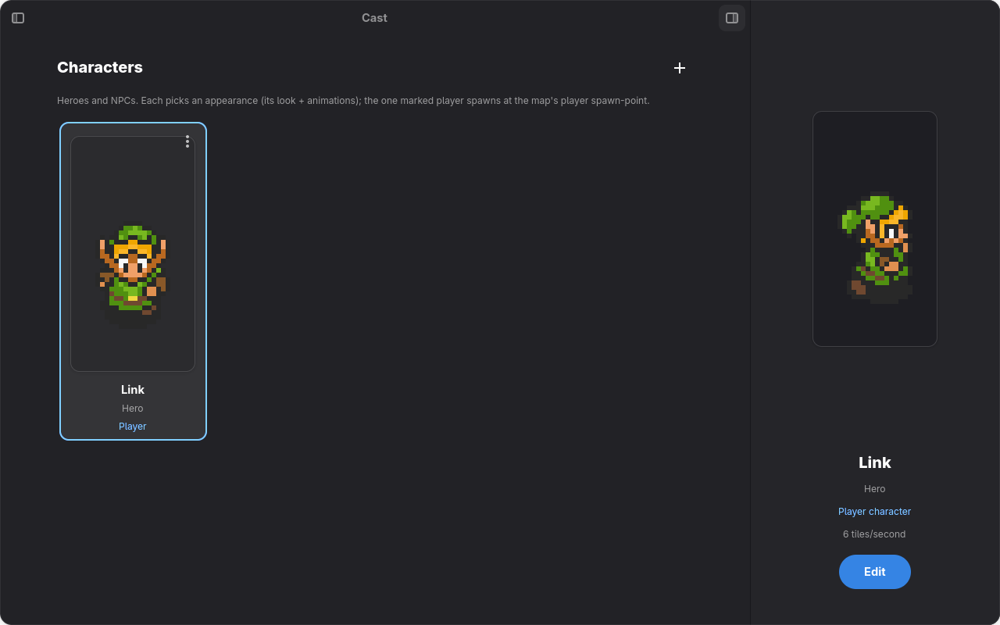](desktop/03-cast.png) | [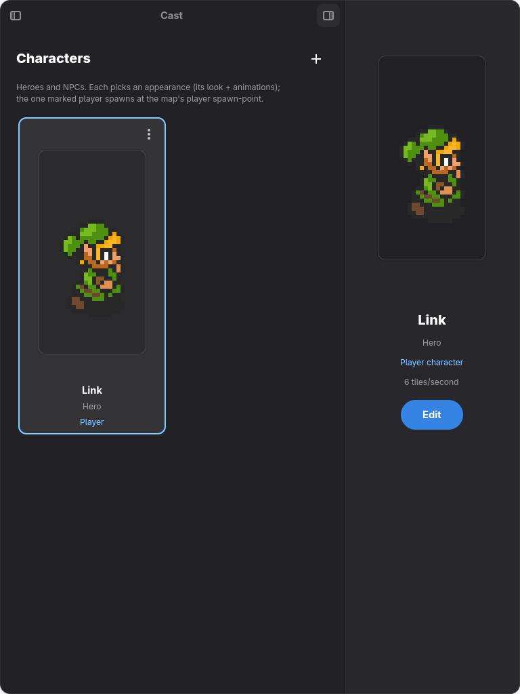](tablet/03-cast.png) | [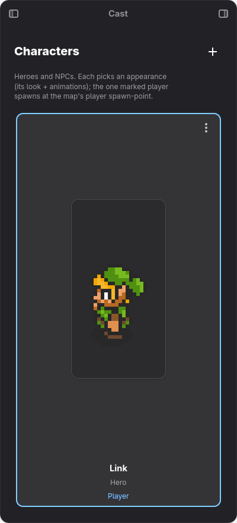](phone/03-cast.png) |

**Purpose** — the **Characters** roster: *"Heroes and NPCs. Each picks an
appearance (its look + animations); the one marked player spawns at the map's
player spawn-point."*

**What you do here**
- Browse characters as cards; select one to see its details in the right
  inspector (role, whether it's the **Player character**, movement speed, **Edit**).
- **+** — add a new character.
- Edit a character (jumps to its appearance/animation editor in Sheets).

**Should be doable / redesign notes** — only one character (Link) exists in the
sample, so the grid is sparse; card grid + single-item inspector is a lot of empty
space on desktop. This is a good candidate for a master-detail layout review.

### 04 · Objects

| Desktop | Tablet | Phone |
|---|---|---|
| [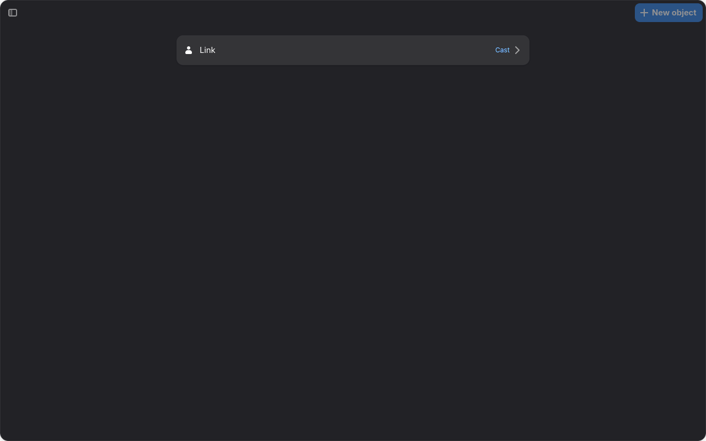](desktop/04-objects.png) | [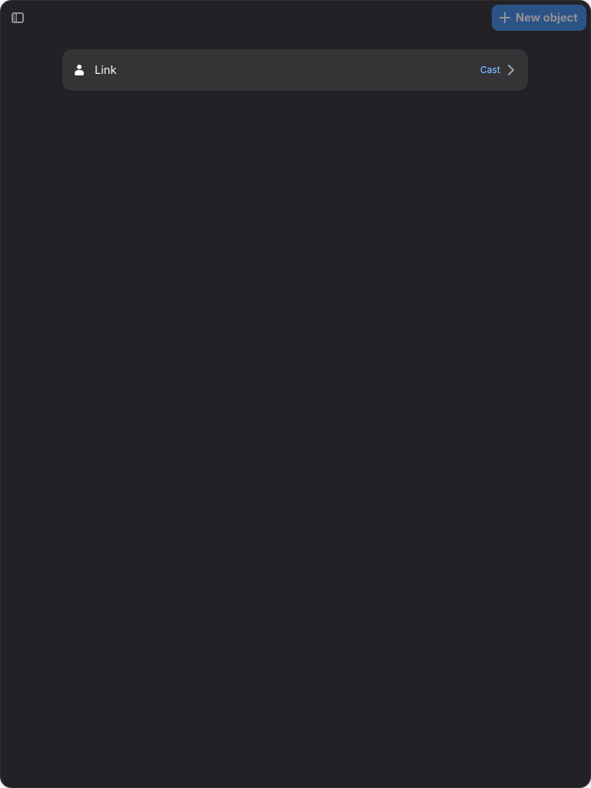](tablet/04-objects.png) | [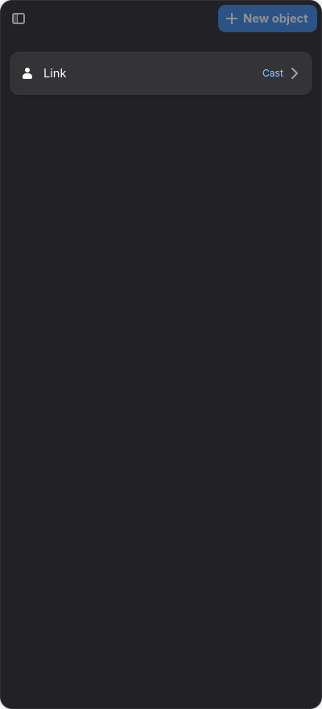](phone/04-objects.png) |

**Purpose** — the **world-object / entity library**: definitions of placeable
things (props, interactables, entity types built from the composition model) that
you drop into scenes. Characters from the Cast also surface here as placeable
entities.

**What you do here**
- List every object definition and drill into its detail page.
- **New object**, delete object.
- (In a scene) these definitions become the palette for the *object* placement tool.

**Should be doable / redesign notes** — the sample project defines **no custom
objects**, so this view is essentially its *empty state* (only the Link character
is listed). Worth designing the empty state deliberately and clarifying the
Objects ↔ Cast ↔ Sheets relationship.

### 05 · Tiles (Sheets)

| Desktop | Tablet | Phone |
|---|---|---|
| [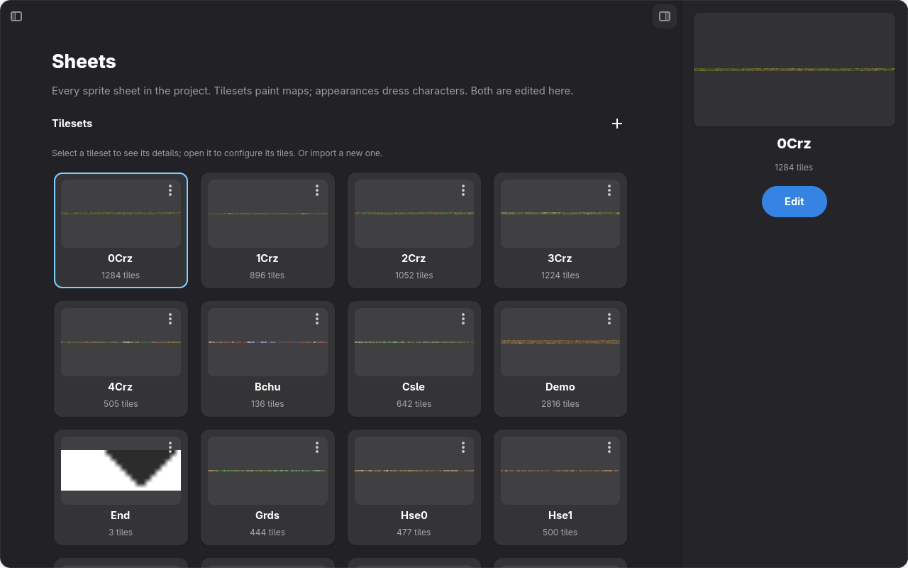](desktop/05-tiles.png) | [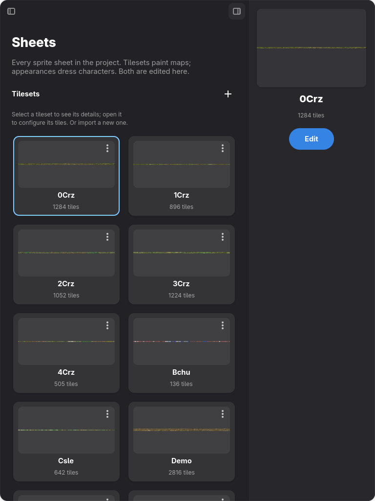](tablet/05-tiles.png) | [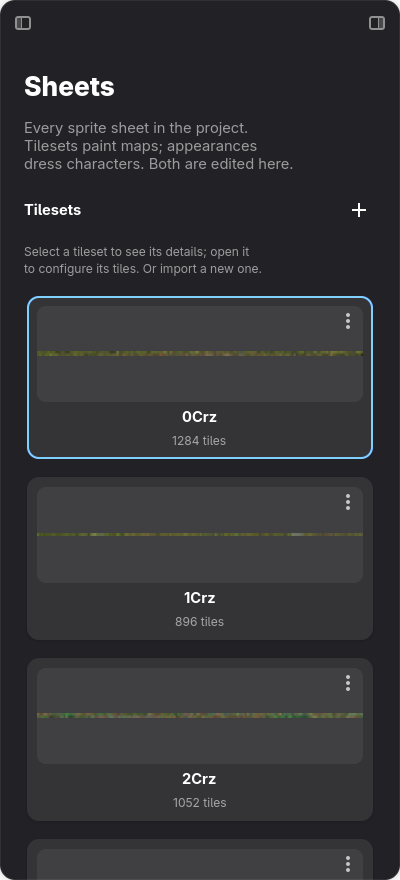](phone/05-tiles.png) |

**Purpose** — **Sheets**: *"Every sprite sheet in the project. Tilesets paint
maps; appearances dress characters. Both are edited here."* The `tiles` view id,
titled "Sheets" in the UI.

**What you do here**
- Browse **Tilesets** as cards (each shows its tile count); select one for details
  in the inspector, **Edit** to configure individual tiles.
- **+** — import / create a new sheet.
- Manage character **appearances** (animation sheets) from the same surface.

**Should be doable / redesign notes** — tileset card thumbnails render as thin
strips (the sheet preview is hard to read at card size); tile-level configuration
lives one level deeper.

### 06 · Data

| Desktop | Tablet | Phone |
|---|---|---|
| [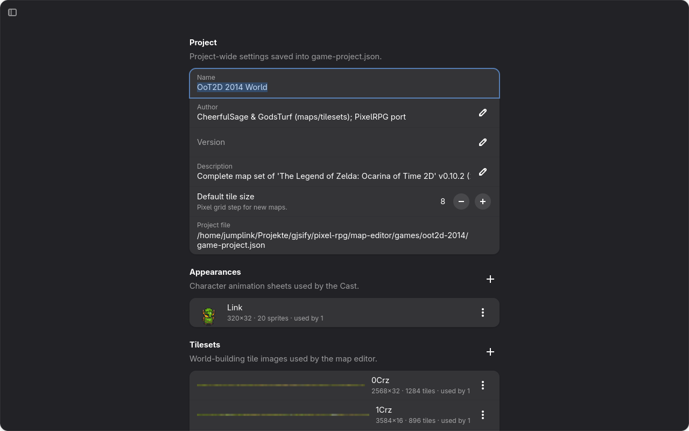](desktop/06-data.png) | [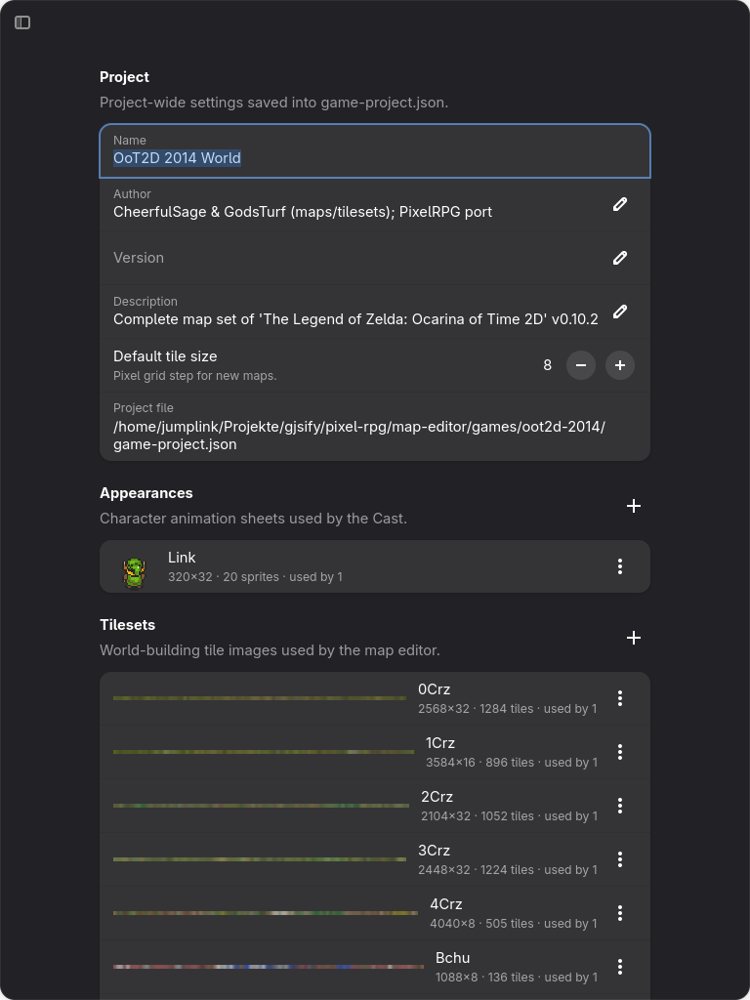](tablet/06-data.png) | [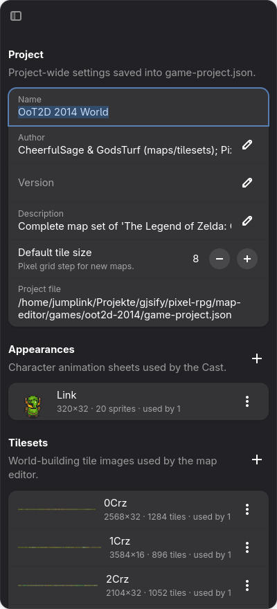](phone/06-data.png) |

**Purpose** — the **Assets & project** surface: *"Project-wide settings saved into
`game-project.json`."* The lower-level, structured view of everything the project
contains.

**What you do here**
- Edit project metadata: **Name, Author, Version, Description, Default tile size**,
  and see the project file path.
- Review **Appearances** (character animation sheets — dimensions, sprite count,
  usage) and **Tilesets** (image, tile count, usage), with **+** to add each.

**Should be doable / redesign notes** — overlaps conceptually with Cast/Sheets
(appearances + tilesets appear here too); the single scrolling column of
preference groups is long. Clarifying "Data" vs "Sheets" vs "Cast" ownership is a
key redesign question.

### 07 · Scene Editor

| Desktop | Tablet | Phone |
|---|---|---|
| [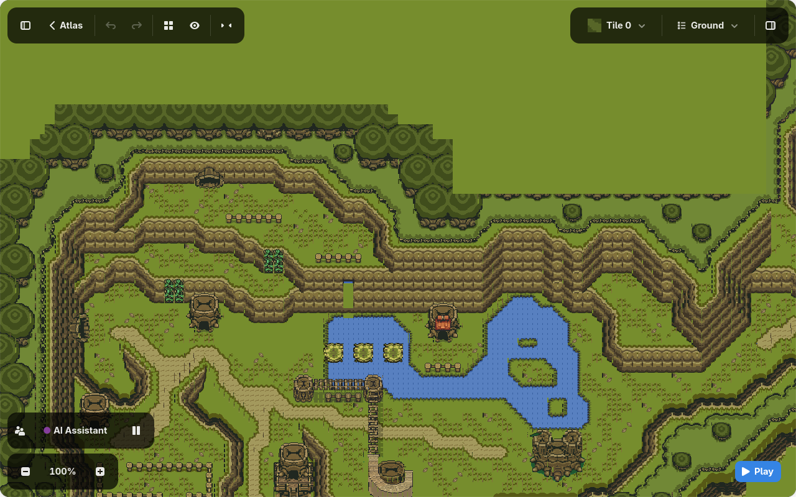](desktop/07-scene-editor.png) | [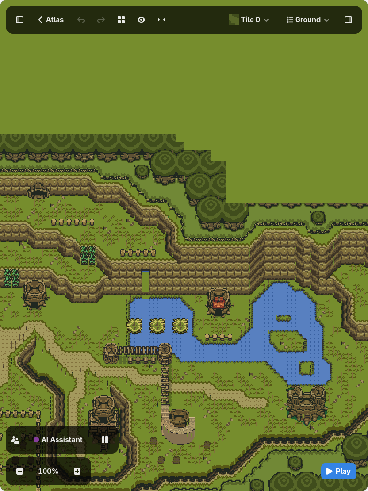](tablet/07-scene-editor.png) | [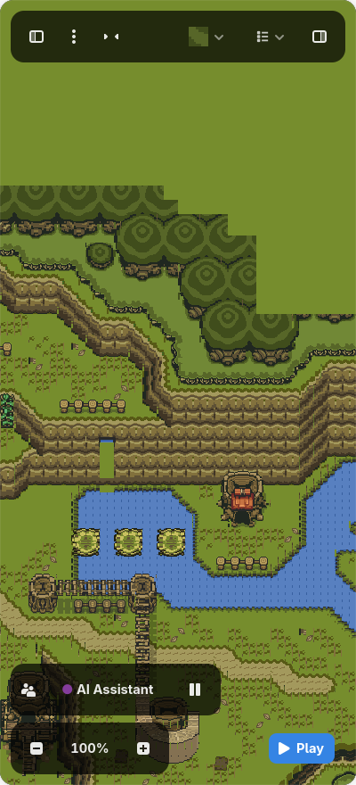](phone/07-scene-editor.png) |

Pure engine content (no chrome): [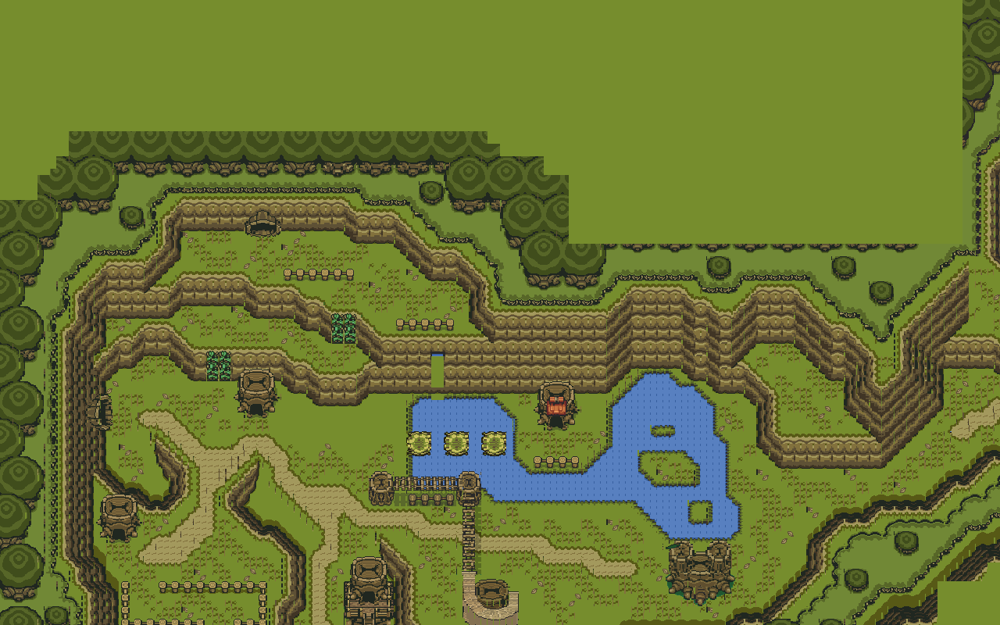](desktop/07-scene-editor-canvas.png)

**Purpose** — the actual **map editing surface**, rendered by the WebGL engine
(Excalibur.js). Where a scene is built tile-by-tile and populated with
characters/objects and teleports.

**What you do here** — chrome around the live canvas:
- **Floating top-left toolbar:** ← Atlas (back), undo / redo, tile-picker,
  visibility (eye), and a layout/panels toggle.
- **Top-right:** active **tile** selector ("Tile 0"), active **layer** dropdown
  ("Ground"), and the inspector toggle.
- **Tools** (`win.set-tool`): `select`, `pencil` (paint), `eraser`,
  `eyedropper` (pick tile), `object` (place entities) — plus **teleport** links
  between scenes.
- **Layers:** add/select layers (e.g. Ground), toggle grid, toggle transparency.
- **Zoom OSD** (bottom-left) — zoom in/out/reset.
- **Play** (bottom-right) — playtest the scene in-engine.
- **Presence chip** — collaborators in a shared session (here: the AI automation).

**Should be doable / redesign notes** — on phone the top toolbar collapses into an
overflow (⋮) menu; a lot of controls compete for the few floating OSD anchors.
Tool discoverability and the tile/layer selectors are the densest areas to review.

---

## Regenerating these screenshots

With the editor running (`gjsify workspace @pixelrpg/maker-gjs start`) and the
`maker` MCP bridge available, drive it view-by-view (`set_view`, `open_scene`,
`resize_window`) and grab each frame from the `Screenshot` D-Bus method. A minimal
GJS grabber:

```js
// gjs -m save-screenshot.js <window|canvas> <out.png>
import Gio from 'gi://Gio'; import GLib from 'gi://GLib';
const [scope, out] = ARGV;
const bus = Gio.bus_get_sync(Gio.BusType.SESSION, null);
const r = bus.call_sync('org.pixelrpg.maker', '/org/pixelrpg/maker/control',
  'org.pixelrpg.maker.Control', 'Screenshot',
  GLib.Variant.new_tuple([GLib.Variant.new_string(scope)]),
  GLib.VariantType.new('(ay)'), Gio.DBusCallFlags.NONE, -1, null);
Gio.File.new_for_path(out).replace_contents(
  r.get_child_value(0).deepUnpack(), null, false,
  Gio.FileCreateFlags.REPLACE_DESTINATION, null);
```
